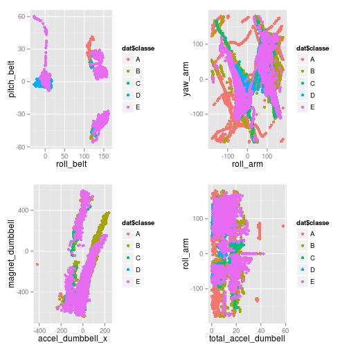

##Summary
This report is for the Machine learning course as a part of the Coursera Data Science specialization. Data for various exersizes is used for this project (see citation at bottom). A random forrest model is created to predict the exersize based on accerometer data.

##Data preperation

The data was loaded and all empty columns were removed. Training and testing data sets were created.


```r
#loading packages
library(caret)
library(randomForest)
library(gridExtra)
dat <- read.csv(file="pml-training.csv",header=TRUE)
#removing columns with no data
dat <- dat[8:160]
dat <- dat[c(1:4,13,16,19,30:42,53:67,77:85,88,91,94,95,106:123,126,129,132,133,144:153)]
dat <- dat[c(1:4,8:29,36:38,48:60,70:80)]

#creating training and test sets
set.seed(69248)
inTrain <- createDataPartition(dat$classe,p=0.5,list=FALSE)
training <- dat[inTrain,]
testing <- dat[-inTrain,]
```

##Exploration

There are 52 predictors in the data, so I created a few random plots below to see how the data is related to eachother.

 

In the plots it is clear that there is a lot of overlap with some of the exersizes, although some show some very different behaviour to the others.

##Model Creation

For the prediction I use a random forest model using all the variables.


```r
model_rf <- randomForest(classe ~ ., data=training)
```

##Model Testing

The model is tested on the remaining data.


```r
rf_predict <- predict(model_rf,newdata=testing)
testing$predRight <- rf_predict==testing$classe
accuracy <- 100*sum(testing$predRight)/nrow(testing)
print(model_rf)
```

```
## 
## Call:
##  randomForest(formula = classe ~ ., data = training) 
##                Type of random forest: classification
##                      Number of trees: 500
## No. of variables tried at each split: 7
## 
##         OOB estimate of  error rate: 0.87%
## Confusion matrix:
##      A    B    C    D    E class.error
## A 2784    3    1    0    2 0.002150538
## B   19 1870    9    1    0 0.015271195
## C    0   18 1691    2    0 0.011689071
## D    0    0   22 1583    3 0.015547264
## E    0    1    1    3 1799 0.002771619
```

The model does a good job and gets most of the exersizes correct. The OOB estimate is < 1%, and the accuracy on the testing set is 99.1539246%, which is pretty good.

##Conclusion

An random forest model was created for an exersize data set. The model was very accurate.

##Data source
Ugulino, W.; Cardador, D.; Vega, K.; Velloso, E.; Milidiu, R.; Fuks, H. Wearable Computing: Accelerometers' Data Classification of Body Postures and Movements. Proceedings of 21st Brazilian Symposium on Artificial Intelligence. Advances in Artificial Intelligence - SBIA 2012. In: Lecture Notes in Computer Science. , pp. 52-61. Curitiba, PR: Springer Berlin / Heidelberg, 2012. ISBN 978-3-642-34458-9. DOI: 10.1007/978-3-642-34459-6_6.

Read more: http://groupware.les.inf.puc-rio.br/har#ixzz3pFZcll5n
